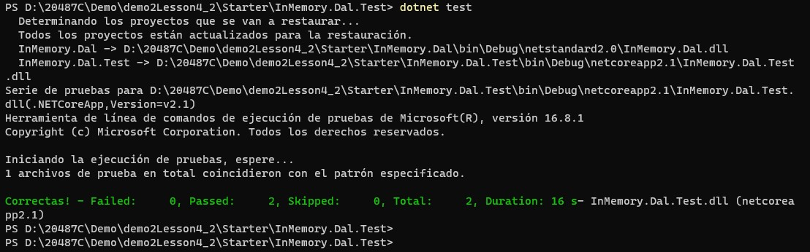

# Module 2: Querying and Manipulating Data Using Entity Framework

# Lesson 4: Manipulating Data

### Demonstration: Using Entity Framework with In-Memory Database

- Abrimos el proyecto de consola InMemory en Visual Studio Code 
- Añadimos el paquete Microsoft.EntityFrameworkCore.InMemory
- Añadimos un constructor de la clase SchoolContext
- Añadimos el parametro DbContextOptions\<SchoolContext\>
- Modificamos el metodo **OnConfiguring** 
- En la clase **DBInMemoryTest** del subproyecto **InMemory.Dal.Test** añadimos la propiedad **_options** y añadimos el metodo **Test**
- Ejecutar

